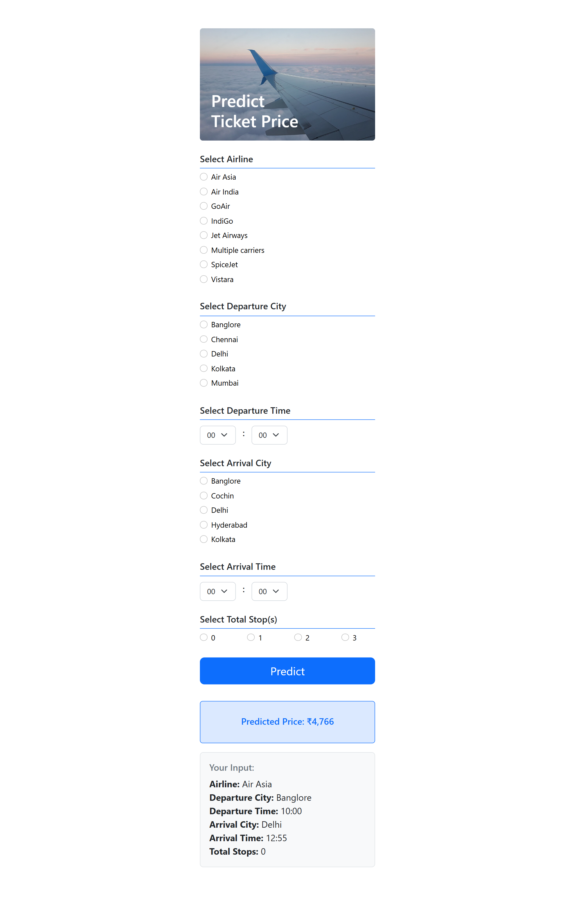

# Airline Ticket Price Prediction (FastAPI + Streamlit)

This is a machine learning web app built with FastAPI and Streamlit to predict airline ticket prices based on user input such as airline, route, time, and number of stops.

## Live App (Streamlit Version)

Visit the app: [https://airline-ticket-price.streamlit.app/](https://airline-ticket-price.streamlit.app/)

Note: If the app doesn't load right away, it may be inactive. Click the "Reboot" button in the top right to restart it.

## Features

- Real-time price prediction
- Simple HTML form with Jinja2 templates (FastAPI)
- Organized project structure
- Docker support for deployment
- Environment-based configuration with `.env`

## Getting Started

### 1. Clone the repository

```bash
git clone https://github.com/tengkumuazabs/airline-ticket-prediction.git
cd airline-ticket-prediction
```
### 2. Create `.env` File
```bash
echo "MODEL_PATH=model.joblib" > .env
```

### 3. Build and Run with Docker
```bash
docker build -t airline-ticket-prediction-fastapi .
docker run -d -p 8000:8000 airline-ticket-prediction-fastapi
```

## Inputs and Output
- Airline (e.g., Air India, IndiGo, Jet Airways)
- Departure City & Time
- Arrival City & Time
- Total Stops
- App returns the predicted ticket price based on input data

## Screenshots (FastAPI + HTML Version)

<div style="display: flex; gap: 20px;">

  <div>
    <p>Home Page</p>
    
  </div>

  <div>
    <p>Prediction Page</p>
    
  </div>

</div>

